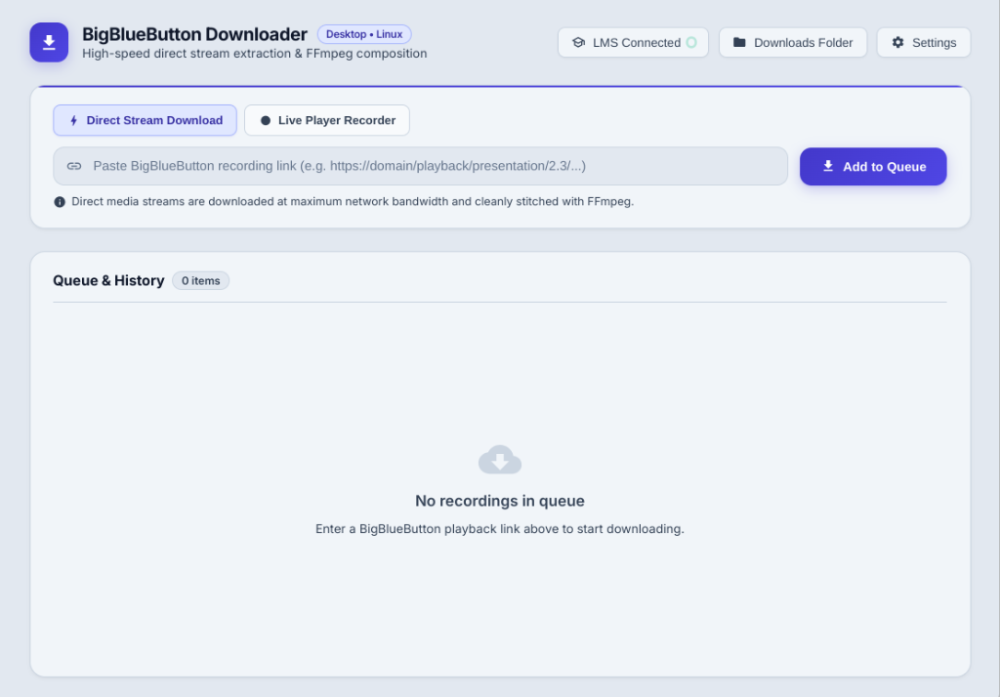

# 🚀 BigBlueButton Downloader (Desktop)

A modern, lightweight, and high-performance desktop application built with **Electron.js** and **FFmpeg** to download, record, and convert **BigBlueButton (BBB)** recorded sessions into high-definition MP4 videos, presentation PDF booklets, and public chat logs.

<p align="center">
  
</p>

---

## ✨ Key Features

* **⚡ Dual Capture Engines**:
  * **Direct Stream Download**: Rapidly downloads original audio, webcam, screen share, and presentation slides directly from the BBB server via concurrent streams and muxes them with FFmpeg in minutes.
  * **Live In-App Player Recorder**: Records the entire interactive session canvas seamlessly in a headless background window—ideal for sessions with complex transitions between slides, whiteboard drawings, and screen shares without requiring an external browser.
* **🔇 Silent Background Recording**:
  * Playback audio can be completely muted locally on your speakers/headphones while preserving crystal-clear audio within the recorded MP4 file.
* **📚 Presentation Slide PDF Booklet**:
  * Automatically compiles all presentation slides into a standalone, printable, high-resolution PDF document with a clean cover page and slide numbering.
* **🎓 Integrated LMS / Moodle Portal**:
  * Built-in browser environment to log into university portals, LMS, or Moodle systems with session cookies automatically transferred for authenticated downloads.
* **💬 Public Chat Export**:
  * Extracts user chat messages and timestamps into a clean text log alongside the downloaded video.
* **⏸️ Robust Queue & Resume Support**:
  * Sequential download queue with Pause, Resume, and automatic exponential-backoff retry on network disruptions.
* **🎨 Modern Dark UI**:
  * Responsive, glassmorphism-inspired dark interface built with Vanilla HTML5/CSS3/JavaScript—fast, lightweight, and bloat-free.
* **🔔 Native System Notifications**:
  * Instant desktop notifications upon task completion.

---

## 🛠️ Technology Stack

* **Core Framework**: [Electron.js](https://www.electronjs.org/) (Main & Renderer architecture)
* **Runtime**: Node.js
* **Media Processing**: Bundled [`ffmpeg-static`](https://github.com/eugeneware/ffmpeg-static) binary
* **UI**: Vanilla HTML5, CSS3 (Variables, Glassmorphism, Micro-animations), Vanilla JavaScript (ES Modules)
* **Target Platforms**: Linux, macOS, Windows

---

## 📂 Project Structure

```text
bigblue-downloader/
├── docs/
│   ├── ARCHITECTURE.md      # Technical architecture and component interactions
│   └── SPECIFICATIONS.md    # System specifications and state machines
├── src/
│   ├── main/                # Electron Main Process (Node.js)
│   │   ├── index.js         # Main application entry point & IPC handlers
│   │   ├── queue.js         # Sequential queue manager with Pause/Resume
│   │   ├── metadata.js      # BBB metadata fetcher and XML parser
│   │   ├── media-downloader.js # Concurrent media downloader with retry logic
│   │   ├── player-recorder.js  # Headless background player recording engine
│   │   ├── recorder-preload.js # MediaRecorder injection script for player
│   │   ├── lms.js           # Integrated LMS portal window & cookie sync
│   │   ├── audio.js         # Audio track processor
│   │   ├── muxer.js         # FFmpeg video/audio/slide muxing engine
│   │   ├── pdf.js           # Presentation slide PDF booklet generator
│   │   ├── chat.js          # Public chat parser and exporter
│   │   └── notifications.js # System desktop notifications
│   ├── preload/
│   │   └── index.js         # Secure ContextBridge IPC bridge
│   └── renderer/            # Renderer UI (Vanilla Web)
│       ├── index.html       # Main application layout & mode switchers
│       ├── lms-welcome.html # LMS portal welcome screen
│       ├── styles/
│       │   ├── variables.css # Design tokens, theme colors & typography
│       │   ├── main.css     # UI component styling
│       │   └── animations.css # Animations and smooth transitions
│       └── app.js           # Renderer event handling and state management
├── test/
│   └── verify-modules.js    # Automated unit and module verification suite
├── package.json
└── README.md
```

---

## 🚀 Quick Start

### Prerequisites
* **Node.js**: v18.0.0 or higher
* **npm**: v9.0.0 or higher

### Installation & Run

1. **Clone the repository**:
   ```bash
   git clone https://github.com/mhdio64/bigblue-downloader.git
   cd bigblue-downloader
   ```

2. **Install dependencies**:
   ```bash
   npm install
   ```

3. **Run tests**:
   ```bash
   npm test
   ```

4. **Start the application**:
   ```bash
   npm start
   ```

---

## 📄 License

This project is licensed under the [MIT License](LICENSE).
