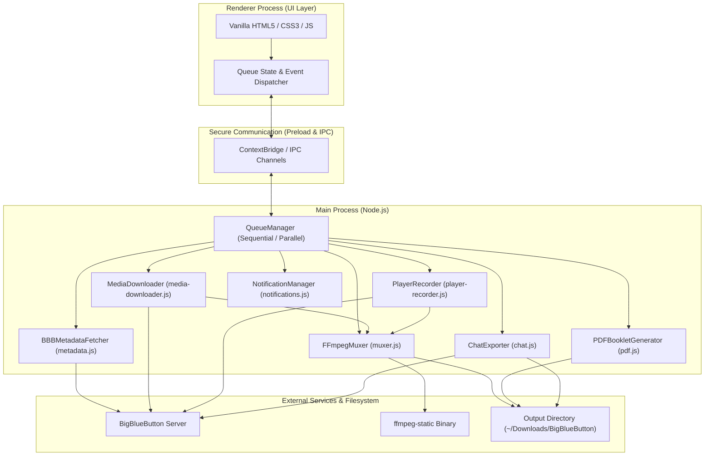
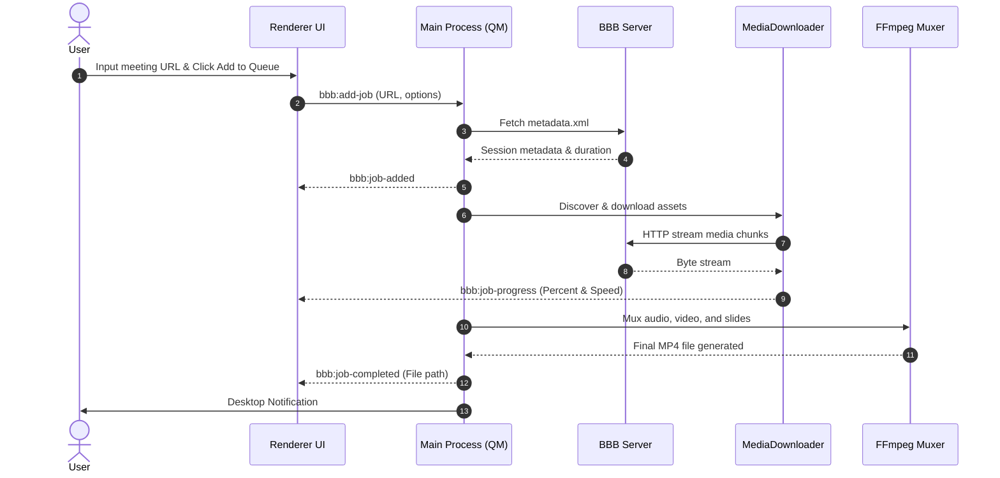

# Technical Architecture: BigBlueButton Downloader

This document details the software architecture, component relationships, process lifecycles, and IPC communication protocols of **BigBlueButton Downloader**.

---

## 1. High-Level Architecture

The application is built on **Electron.js** multi-process architecture. It captures session assets via concurrent direct HTTP streaming and background player recording, processing them using bundled **FFmpeg**:

---

## 2. Process & Module Breakdown

### 2.1. Main Process

1. **`QueueManager` (`src/main/queue.js`):**
   - Coordinates job lifecycle: enqueue, start, pause, resume, cancel, and complete.
   - Manages execution concurrency and resource allocation.
   - Cleans up temporary files instantly when jobs are cancelled or fail.

2. **`BBBMetadataFetcher` (`src/main/metadata.js`):**
   - Parses `metadata.xml` to extract meeting title, recording date, and total duration.
   - Decodes numeric HTML/XML entities to ensure foreign language titles render correctly.

3. **`MediaDownloader` (`src/main/media-downloader.js`):**
   - Automatically detects asset availability:
     - Screen share: `deskshare/deskshare.webm` or `.mp4`
     - Instructor webcam: `video/webcams.webm` or `.mp4`
     - Audio: `audio/audio.webm` or `.ogg`
     - Presentation slides: `shapes.svg` and slide image frames
   - Downloads assets concurrently with exponential backoff and resume support.

4. **`PlayerRecorder` (`src/main/player-recorder.js`):**
   - Headless background BrowserWindow that loads the interactive BBB player.
   - Injects `recorder-preload.js` to capture the composite canvas via `MediaRecorder`.
   - Supports local speaker muting (`win.webContents.setAudioMuted(true)`) while preserving audio in the stream.

5. **`SlideBookletGenerator` (`src/main/pdf.js`):**
   - Parses SVG slide elements and downloads slide frame images.
   - Compiles them into a high-resolution printable PDF booklet with page numbering and metadata.

6. **`FFmpegMuxer` (`src/main/muxer.js`):**
   - Combines video, webcam, slide presentations, and audio tracks into a single standard MP4 file.
   - Employs H.264 video encoding and AAC audio encoding for universal player compatibility.

7. **`ChatExporter` (`src/main/chat.js`):**
   - Extracts public chat messages and timestamps to `[Meeting Title] - Chat.txt`.

8. **`NotificationManager` (`src/main/notifications.js`):**
   - Emits native OS desktop notifications upon task completion.

---

## 3. Direct Execution Sequence

